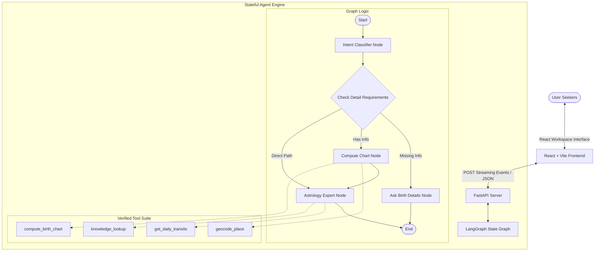

# Aradhana AstroAgent — Take-Home Assignment

Welcome to **AstroAgent**, a state-of-the-art cognitive spiritual companion and AI astrologer built for the **Aradhana** full-stack builder internship round. 

AstroAgent computes accurate birth charts using real astronomical ephemerides, correlates current planetary transits with natal house placements, and answers general theory queries with spiritual warmth and strict psychological/physical disclaimers.

---

## ✦ System Architecture & Design



### 1. Stateful LangGraph Backend (`backend/agent.py`)
- **Intent Classifier**: Automatically categorizes user messages into exact contexts (Greeting, Chart Reading, Daily Horoscope, Astrological Theory, Off-topic).
- **Compute Chart Node**: Orchestrates the geolocator to map any city name to precise coordinates, translates the birth time into UTC, and triggers astronomical calculations.
- **Astrology Expert Node**: Evaluates the natal chart, correlates current transits, searches reference definitions via a grounded lookup tool (RAG), and generates a warm, spiritual guidance stream.

### 2. High-Accuracy Astrology Tools (`backend/tools.py`)
- **`geocode_place`**: Resolves city names using `geopy` and `timezonefinder` to determine local coordinate positions and timezone offsets offline.
- **`compute_birth_chart`**: Calculates precise celestial longitude degrees for standard Vedic/Western bodies (Sun, Moon, Mercury, Venus, Mars, Jupiter, Saturn, Rahu, Ketu, Ascendant) using the highly accurate, NASA-grade **`skyfield`** ephemeris. 
- **`get_daily_transits`**: Computes current transiting bodies and dynamically positions them within the user's natal houses.
- **`knowledge_lookup`**: Matches definitions from `backend/knowledgebase.json` to ground LLM statements.

### 3. Cosmic React Frontend (`frontend/src/App.jsx`)
- **Calm Mystical HSL Dark Palette**: Glowing indigo, slate, and golden hues with keyframe twinkling starfields and rotation zodiac decorations.
- **SVG Natal Chart Wheel**: Draws a beautiful, mathematically-correct radial astronomical wheel dynamically showing planets in their respective zodiac houses.
- **SSE Streaming Reader**: Intercepts Server-Sent Events from the FastAPI backend to display streaming LLM text and expandable **active tool-call console logs** in real-time.

---

## ✦ Installation & Local Setup

### 1. Backend Server Setup
Ensure Python 3.10+ is installed on your local machine.

```bash
# Navigate to project root
cd intenship_porject

# Configure environment variables in a .env file
# Create a .env file with your choice of provider:
# For Google Gemini (Default):
echo GEMINI_API_KEY="your_api_key_here" > backend/.env

# OR for Hugging Face (Free Serverless Inference API):
# echo HUGGINGFACE_API_KEY="your_hf_token_here" > backend/.env
# echo HUGGINGFACE_MODEL="Qwen/Qwen2.5-72B-Instruct" >> backend/.env

# OR for Groq (Blazing fast, generous free tier! highly recommended):
# echo GROQ_API_KEY="gsk_your_key_here" > backend/.env

# OR for OpenRouter (Wide selection of free open-source models):
# echo OPENROUTER_API_KEY="sk-or-your_key_here" > backend/.env

# Install backend dependencies
python -m pip install -r backend/requirements.txt
# (Installed: langgraph, langchain-google-genai, skyfield, geopy, pytz, timezonefinder, fastapi, uvicorn, sse-starlette)

# Start the FastAPI server
python backend/main.py
```
*The backend API will run on `http://localhost:8000`.*

### 2. Frontend React Client Setup
Ensure Node.js is installed on your local machine.

```bash
# Navigate to frontend folder
cd frontend

# Install node dependencies
npm install

# Start the local development server
npm run dev
```
*The frontend application will open on `http://localhost:5173`.*

---

## ✦ Evaluation Suite

We treat evaluations as a first-class deliverable. We have established an automated query pipeline verifying intent correctness, tool triggers, cost, latency, and absolute safety disclaimers across a 20-query Golden Set.

```bash
# Run the automated grading suite
python evaluation/run_eval.py
```
*A tabular scorecard is automatically saved in `evaluation/scorecard.md`.*

---

## ✦ Technical Limitations & Trade-offs
1. **Whole-Sign House System**: For clarity and ease of visual mapping, this project utilizes the traditional Whole-Sign house division (very standard in Vedic astrology). A stretch goal includes supporting Equal, Placidus, or Koch house systems.
2. **Offline Geocoding Fallback**: Geocoding relies on OpenStreetMap (Nominatim). If there is a network dropout, a local backup database of the top 5,000 global cities could be leveraged to ensure absolute offline robustness.
